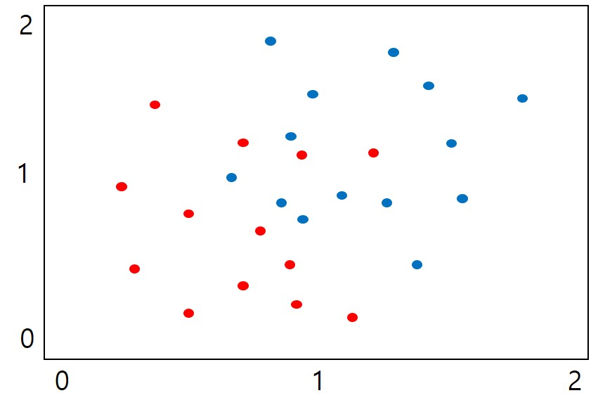
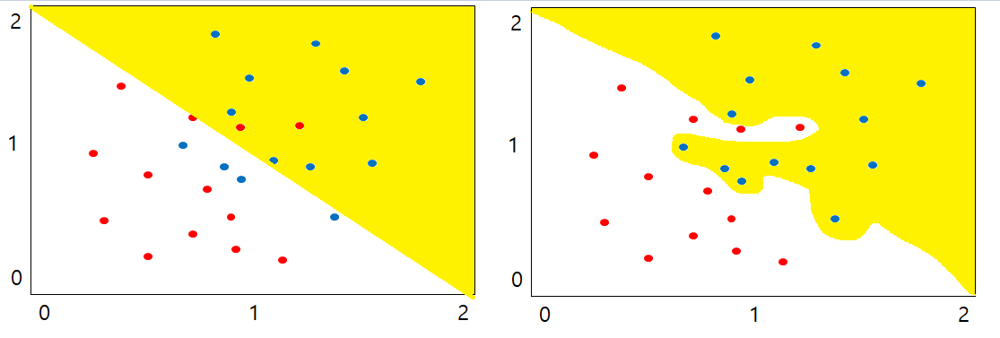
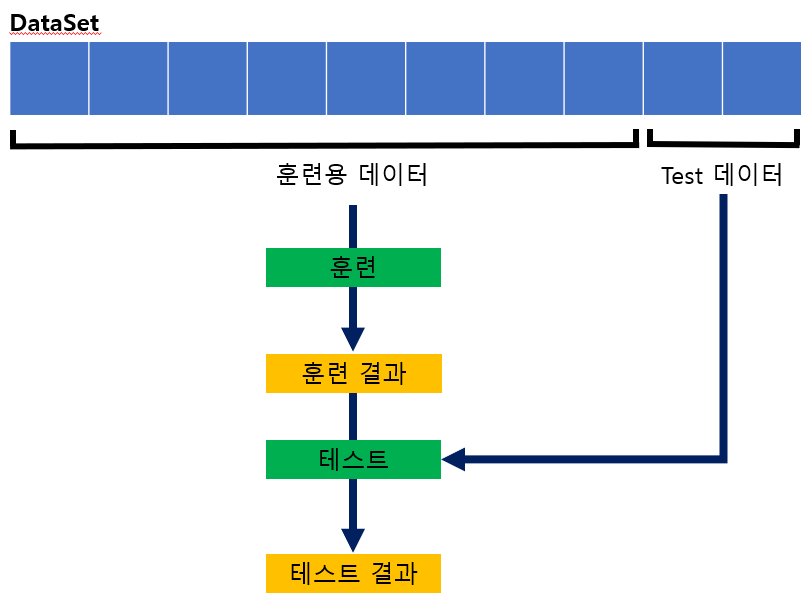
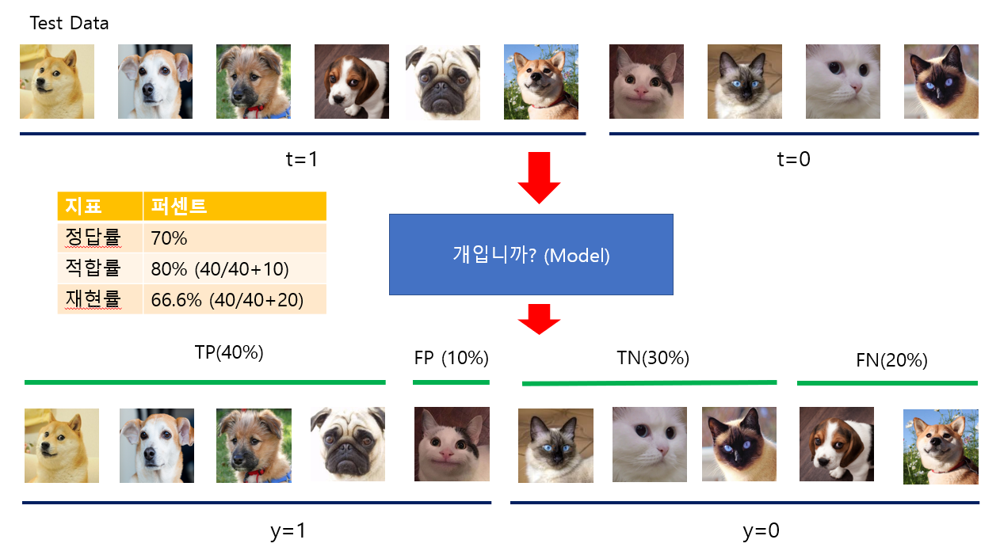

# 3.7 모델 평가
## 3.7.1 분류에서 예측으로

- 실제 세계에서는 다음과 같이 노이즈가 섞여있거나 겹쳐진 데이터가 존재할 수 있다. 이와 같은 데이터들이 주어졌을 때 어떻게 분리하여야 할까?

- 오른쪽의 분류가 가장 이상적인 분류이다.
- 왼쪽의 분류 역시 '잘 분류했다'고 판단하는 것은 데이터의 경향성을 잘 파악하여 분류하였기 때문이다.
- 비슷한 데이터가 주어졌을 때, 왼쪽처럼 **데이터의 경향성을 어느 정도 잘 분류할 수 있는 법**을 생각해야 한다.

## 3.7.2 예측을 평가

- 현재 모델이 비슷한 데이터에서도 잘 분류하는 지를 확인하기 위하여,  
  전체 데이터셋에서 훈련용 데이터와 테스트 데이터로 나누고, 훈련용 데이터로 훈련을 진행한 뒤 테스트 데이터로 평가한다.

### 혼합 행렬
모델이 예측한 값을 y, 실제 값을 t라고 하였을 때, y와 t의 결과에 따라 가능한 조합으로 나타낸 것이 아래의 **혼합 행렬**이다.

|| $y=1$ | $y=0$|
|-|-|-|
|$t=1$|TP (True positive, 진양성)|FN(False Negtive, 위음성)|
|$t=0$|FP (False postivie, 위양성)|TN(True Negative, 진음성)|

### 모델 평가 지표
위의 혼합 행렬에 있는 값을 이용하여, 모델의 의미를 판단하는 지표는 아래와 같다.

|명칭|식|설명|
|-|-|-|
|정답률(Accuracy)|${TP+TN} \over {TP+FN+FP+TN}$|전체 데이터 중 예측 값과 실제 값이 맞은 비율|
|적합률(Precision)|${TP} \over {TP+FP}$|모델에서 발화한 데이터$(y=1)$ 중 실제로 발화해야 됐던 데이터$(t=1,y=1)$의 비율|
|재현률(Recall)|${TP} \over {TP+FN}$|모델에서 발화해야 하는 데이터$(t=1)$ 중 실제로 발화한 데이터$(t=1,y=1)$의 비율|

### 평가에 대한 예시

- 사진을 주어주고 개를 판별하는 모델을 만들었다고 가정해보자.
- 위와 같이 6마리의 개와 4마리의 고양이가 있는 테스트 데이터를 모델에 입력했을 경우를 생각해본다.
- 이 모델은 4마리의 개와 1마리의 고양이를 개라고 판별한다.
- 이 모델은 3마리의 고양이와 2마리의 개를 개가 아니라고 판별했다.
- 위의 모델을 혼합행렬로 나타냈을 때 아래와 같이 볼 수 있다.

|조합|데이터 개수|
|-|:-:|
|진양성|4|
|위양성|1|
|진음성|3|
|위음성|2|

- 위의 모델을 지표로 판단했을 때, 다음과 같은 퍼센티지를 보여준다.

|지표|퍼센트|계산|
|-|:-:|-|
|정답률(Accuracy)|70%|${4+3}\over{4+1+3+2}$|
|적합률(Precision)|80%|${4}\over{4+1}$|
|재현률(Recall)|66.6%|${4}\over{4+2}$|

## 3.7.3 실험
