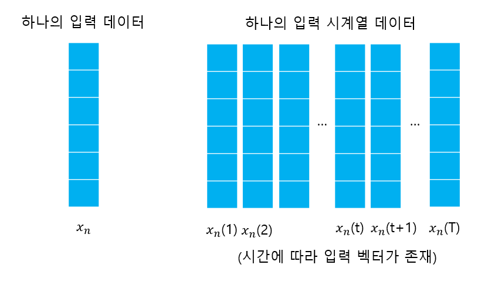
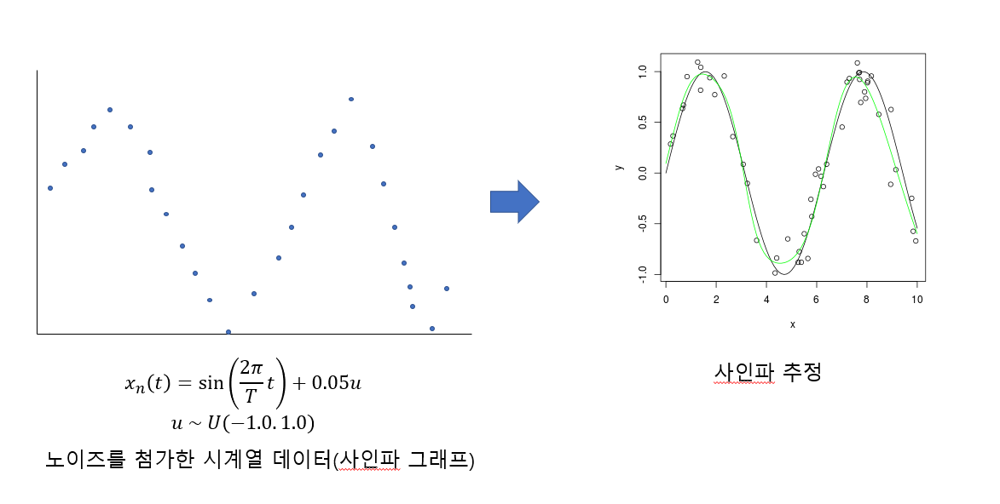
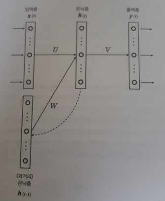
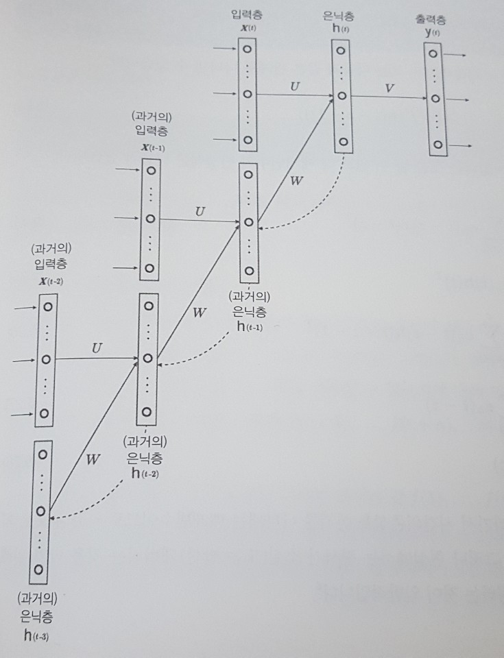
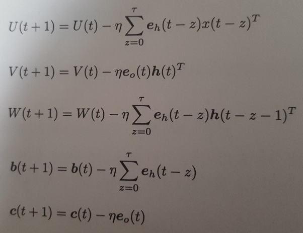

# 5.1 기본사항

## 5.1.1 시계열 데이터

### 사인파 예측

출처 : https://stackoverflow.com/questions/1565115/approximating-function-with-neural-network?rq=1

## 5.1.2 과거의 은닉층

- 입력층 ->  은닉층

    입력 패러미터 :  출력 값 : 

    

- 은닉층 -> 출력층

    입력 패러미터 :  출력 값 : 

    

- 오차 함수

     

  

    이 떄, 라고 하면,  
     , 이다.

    따라서, 오차함수에서 각각 은닉층에 따른 오차항과 출력층에 따른 오차항을  
    , 라고 할때, 아래와 같이 쓸 수 있다.

    

    

    오차 함수의 패러미터인 , , , , 에 대한 오차항은 아래와 같다.

    

    

    

    
    

    

- 사인파 모델에서의 출력 함수.

   - 기존의 모델(소프트맥스 함수, 시그모이드 함수)에서는 y(t)의 값이 0 혹은 1을 가지고 있는 이산값이나, 0.0 ~ 1.0 내의 확률이었음.
    

   - 사인파의 경우, 출력값이 확률이 아니라 함수값이어야 하므로 그대로 사용
    

- 사인파 모델에서 오차 함수

  - 모델의 예측값 와 정답인 값 와의 오차를 최소화해야 함.
  - 아래와 같은 제곱 오차함수를 통해 0~T까지의 모든 예측값과 정답값의 오차의 절대값이 합이 최소가 되도록 오차함수를  만든다.

    

## 5.1.3 Backpropagation Through  Time

- 위의 제곱 오차함수를 적용할 때, 오차항은 아래와 같다.

- 은닉층 h(t)는 h(t-1)의 영향을 받는다. 따라서, 역전파시 t-1에 대한 오차 역시 생각해주어야 한다.

- 오차를 시간을 거슬러 역전파하게 되는 것을 Backpropagation through time, 줄여서 BPTT라고 한다.

- 은닉층 h(t)는 h(t-1)의 영향을 받으므로, h(t)의 오차인 에 대한 식으로 h(t-1)의 오차인 를 표현해야 한다.

- 이를 재귀적으로 내려가면, 은닉층 h(t-z)와 h(t-z-1)에서의 오차 , 에 대해서 구할 수 있다.

- 이 오차를 모든 매개변수에 대해 나타내면 아래와 같다.

- 이 때, 는 얼마만큼 과거로 올라갈 건지에 대해 나타내는 변수이다. 결과가 소실되는 것을 방지하기 위해 10~100 정도로 잡는다.