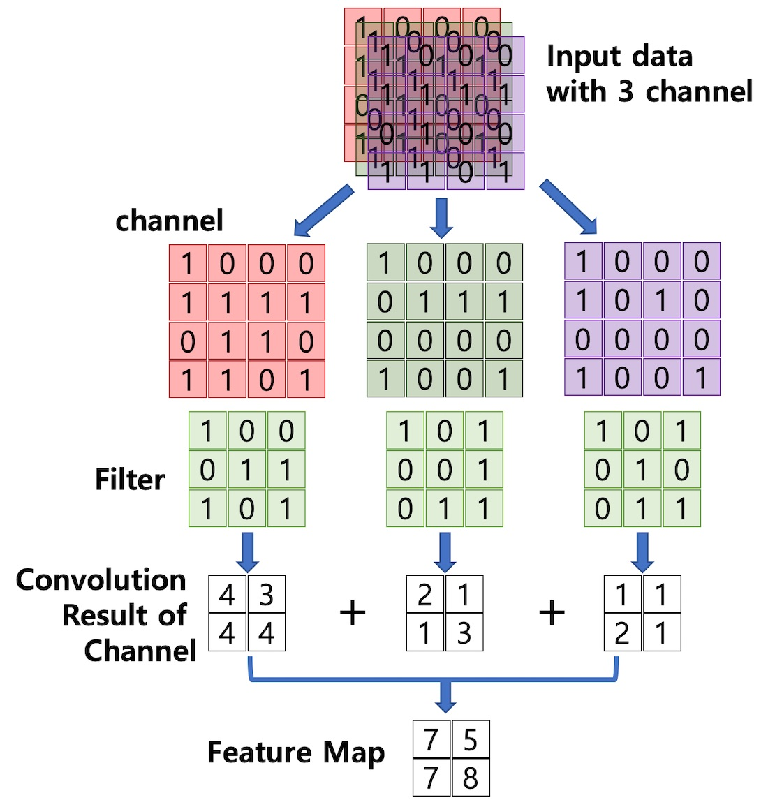
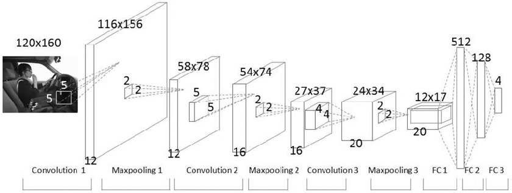

# Convolutional Neural Network

## 1. Image를 Vector로 생각


- 위 사진의 64x64 image는 각각 [255, 255, 255]의 최대값을 가지고 있는 3차원 벡터의 묶음으로 볼 수 있다.


- 여러 장의 image를 넣었을 경우, 벡터의 차원이 늘어난다. (몇 번째 Image 혹은 한 Image의 몇 번째 pixel)
  


- 위 그림에서와 같이 Neural Network Model에 Image를 Input Data로 집어넣는다고 가정했을 경우, 굉장히 많은 양의 정보가 Parameter로 들어간다.
- 여러 개의 Image를 Input Data를 넣었을 때 정보의 크기는 더 커지며, 연산 속도가 **매우 느려지게 된다.**

## 2. Convolution

### 정의

> 합성곱 연산은 두 함수 f, g 가운데 하나의 함수를 반전(reverse), 전이(shift)시킨 다음, 다른 하나의 함수와 곱한 결과를 적분하는 것을 의미한다.
> 
> 출처: https://ko.wikipedia.org/wiki/%ED%95%A9%EC%84%B1%EA%B3%B1

### 예시


함수 , 가 그래프 상에 놓여있다.


함수 를 반전한다.


함수 를 이동한다.


함수 와 를 곱한 값을 t에 대해서 적분한다.


<p align="center"></p>

## 3. Image에서의 Convolution 연산

### GrayScale Image


생각하기 쉽게 우리가 일상적으로 보는 3차원 Vector로 표현가능한 Image에서 명암 구분만 있는 흑백 Image로 바꿔 1차원 Vector의 묶음으로만 다뤄보자.

### Convolution의 활용

- 각종 영상 처리에서 위에서 소개한 Convolution 연산이 활용된다. 아래 예시를 보자.
  

- 위 그림과 같이 이미지를 흐리게 하려고 한다.


- 원본 이미지의 모든 픽셀에 특정 필터를 적용해 영상처리를 할 수 있다. 그림에서 소개한 필터링은 3*3 크기의 가우시안 필터를 활용하여 이미지를 필터링한 것이다.
  

- 조금 더 자세하게 들어가서, 이미지의 특정 픽셀에 가우시안 필터를 적용해보고자 한다.


- 현재 픽셀을 중심으로 필터를 씌운다고 하면, 위 그림과 같이 표현할 수 있다.


- 현재 픽셀에서 가우시안 필터를 적용한 픽셀 값을 구하려면, 필터의 값과 씌워진 필터에 해당하는 픽셀을 곱한 뒤 나온 모든 값을 더하면 된다.


<p align="center"></p>


- 이러한 작업을 모든 픽셀에 대해서 수행하면, 위 그림의 오른쪽과 같이 blur처리된 이미지를 얻을 수 있다.


 : 원래 image의 fixel 값  
 : filter matrix의 값  
 : filter matrix의 x축 중앙  
 :  filter matrix의 y축 중앙  
 :  filter matrix의 너비  
  : filter matrix의 높이  

라고 가정하면, 필터링한 픽셀의 값을 구하는 식 아래와 같이 유도할 수 있다.


<p align="center"></p>

앞서 소개한 Convolution을 나타낸 식인

<p align="center"></p>
와 유사하며, 실제로 Filtering 작업은 Image에 filter matrix를 convolution 연산하는 것과 같은 의미이다.

## 4. CNN의 주요 용어 정리

> 출처 : http://taewan.kim/post/cnn/

### 4-1. Channel

Image Pixel을 표현하는 Vector에서의 차원(dimension)

- 예시
  - GrayScale Image (1 Channel)
  - RGB Image (3 Channel)
    - Red Channel
    - Green Channel
    - Blue Channel
  - RGBA Image (4 Channel)
    - Red Channel
    - Green Channel
    - Blue Channel
    - Alpha Channel 


출처 : https://en.wikipedia.org/wiki/Channel_(digital_image)

### 4-2. Filter / Kernel

이미지의 특징을 찾아내거나 부여하기 위한 공통 파라미터


- CNN에서는 **Filter는 Kernel과 같은 말**이다.

### 4-3. Feature Map

이미지에서 필터를 통해 특징을 추출한 결과 Matrix.


- 이미지의 특징을 유지한 채, 데이터 크기가 줄어드는 특징이 있다.

### 4-4. Padding

- feature map이 입력 데이터의 크기보다 작기 때문에, filtering 후 출력 데이터의 개수를 입력데이터와 맞추기 위하여 Feature map의 가장자리에 지정된 픽셀만큼 특정 값으로 채워넣는 것.
  


### 4-5. Pooling

Image matrix에서 특정 범위 안에 있는 값 중 대표값을 만들어서 더 적은 Data의 Matrix를 추출하는 것.


- 더 적은 데이터로 이미지의 특징을 모으고 강화하는 역할을 한다.

## 5. CNN

### 배경
- Fully Connected Neural Network를 통해 Image를 처리하기엔, Image에 담긴 데이터의 크기가 너무 많다.
- 따라서, Image에 담긴 공간 정보를 유지한 채 Data 크기를 줄일 필요가 있다.
- Image의 공간 정보를 유지한 채 학습시키는 것이 **Convolutional Neural Network**다.

### 과정

- CNN에서 크게 두 가지 작업을 수행한다.
    - Feature Extraction
    - Classification

- Feature Extraction
  - input Data(Image)의 특징을 유지한 채, 더 적은 Data로 변환하는 작업

- Classfication
  - 기존의 Machine Learning Model과 마찬가지로, Feature Extraction을 통해 줄어든 데이터를 바탕으로 분류를 진행. 주로 SoftMax를 적용. 

### Feature Extraction


- Convolution Layer와 Max pooling Layer를 여러 개 두어 이미지의 차원을 줄이고 이미지의 특징을 추출한다.

- 하나의 Layer에 여러 개의 Filter를 둘 수 있다.


출처 : http://taewan.kim/post/cnn/

- Convolution Layer에서 특정 이미지의 각 채널에 대해서 Filtering을 한 후 나온 Channel Map을 모두 더해 Feature Map을 뽑아낼 수 있다.  
이를 통해, 이미지의 차원을 줄일 수 있다.

### CNN 구조도



### CNN의 강점


- 각 레이어의 입출력 데이터의 형상 유지
- **이미지의 공간 정보를 유지**하면서 인접 이미지와의 특징을 효과적으로 인식
- 복수의 필터로 이미지의 특징 추출 및 학습
- 추출한 이미지의 특징을 모으고 강화하는 Pooling 레이어
- 필터를 공유 파라미터로 사용하기 때문에, 일반 인공 신경망과 비교하여 **학습 파라미터가 매우 적음**

## 6. Keras Code

```python
from keras.models import Sequential
from keras.layers.convolutional import Conv2D
from keras.layers.convolutional import MaxPooling2D
from keras.layers import Dense
from keras.layers import Flatten

model = Sequential()

## 1> Feature Extraction
# 1-1) Convolution 1
model.add(Conv2D(12, kernel_size=(5, 5), activation='relu', input_shape=(120, 60, 1)))
# 1-2) Max Pooling 1
model.add(MaxPooling2D(pool_size=(2, 2)))
# 2-1) Convolution 2
model.add(Conv2D(16, kernel_size=(5, 5), activation='relu'))
# 2-2) Max Pooling 2
model.add(MaxPooling2D(pool_size=(2, 2)))
# 3-1) Convolution 3
model.add(Conv2D(20, kernel_size=(4, 4), activation='relu'))
# 3-2) Max Pooling 3
model.add(MaxPooling2D(pool_size=(2, 2)))

# 2> Make 1-dimension Data
model.add(Flatten())

## 3> Classification
model.add(Dense(128, activation='relu'))
model.add(Dense(4, activation='softmax'))

## http://taewan.kim/post/cnn/
```
