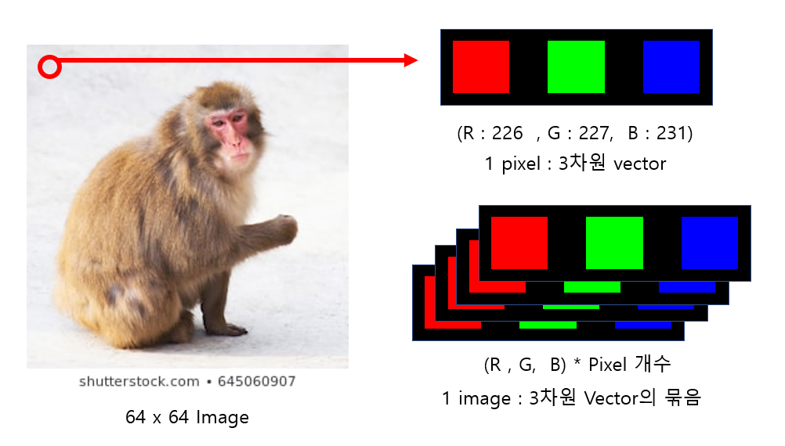
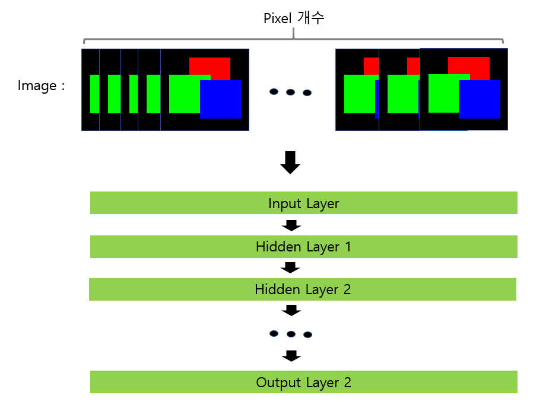

# Convolutional Neural Network

## 1. Image를 Vector로 생각

- 위 사진의 64x64 image는 각각 [255, 255, 255, 64x64]의 최대값을 가지고 있는 4차원 Vector로 생각할 수 있다.

- 위 그림에서와 같이 Neural Network Model에 Image를 Input Data로 집어넣는다고 가정했을 경우, 굉장히 많은 양의 정보가 Parameter로 들어간다.
- 여러 개의 Image를 Input Data를 넣었을 때 정보의 크기는 더 커지며, 연산 속도가 매우 느려지게 된다.