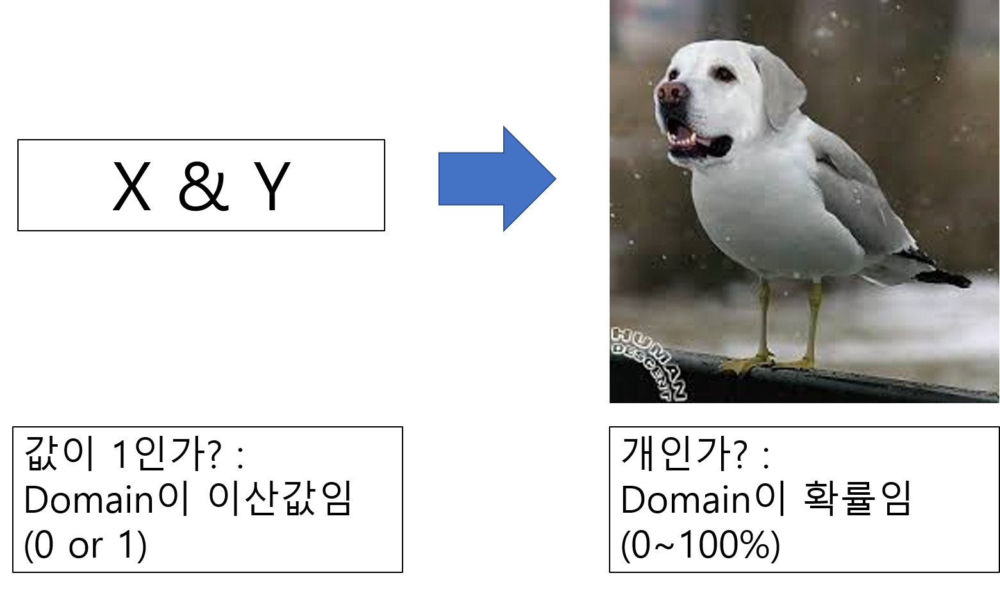
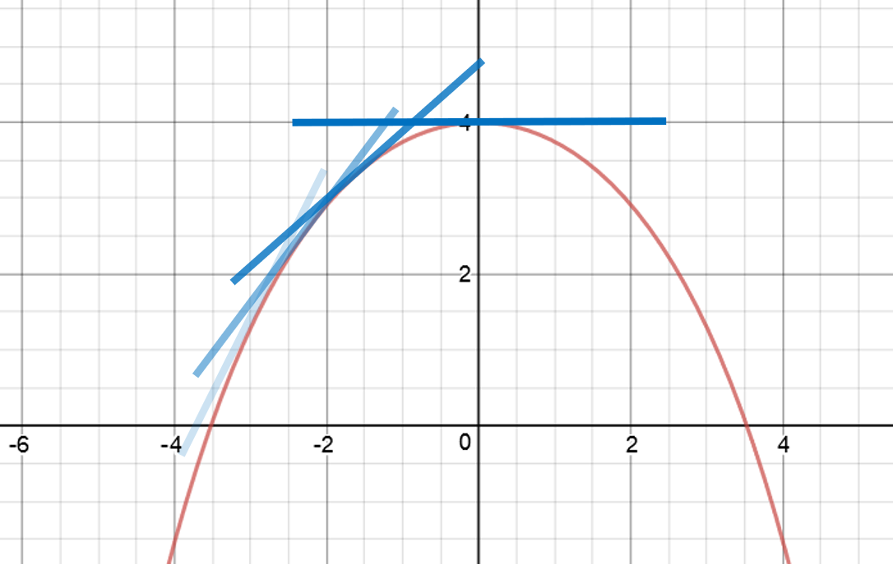

# 3.4 로지스틱 회귀
## 3.4.1 계단 함수와 시그모이드 함수

### 시그모이드 함수
$$ \sigma(x) = {{1} \over {1+e^x}} $$

- 출력값을 0, 1이 아닌 확률로서 나타내기 위해 도입

- 미분값을 자기 자신을 이용하여 표현할 수 있음.
  
  $$ \sigma'(x) = \sigma(x)(1-\sigma(x)) $$

## 3.4.2 모델화

### 3.4.2.1 우도함수와 교차 엔트로피 오차 함수

- 뉴런의 발화 여부 모델링
  - 뉴런이 발화할 확률 `(C=1)`  
  예 : 개인가?

    $$ p(C=1|x) = \sigma(w^{T}x+b) $$

  - 뉴런이 발화하지 않을 확률 `(C=0)`  
  예 : 개가 아닌가?

     $$ p(C=0|x) = 1 - p(C=1|x) $$

  - 뉴런이 발화할 확률 `(C=t)`
  
      $$ y = \sigma (w^{T}+b) $$

      라고 할 때  
      (C=1)이면 y이고, (C=0)이면 1-y이므로,  
      아래와 같이 표현할 수 있다.

      $$p(C=t|x) = y^{t}(1-y)^{1-t} $$

  - 이 때 입력 데이터가 N개 존재하여, 그 값을 각각 $x_{n} (1 \leq n \leq N)$이라고 하자.
  - 이 때 출력 데이터도 N개 존재하고, 그 값을 $t_{n}$이라고 하자.
  - N개의 입력 데이터에 대한 총 뉴런의 발화 확률은 아래와 같다.
  - 
  $$ p(C=t_1|x_1)p(C=t_2|x_2)...p(C=t_N|x_N) = \prod_{n=1}^{N} p(C=t_n|x_n) = L(w,b)$$

  - $L(w,b)$를 **우도함수**라고 하며, 이 값이 최대가 되도록 파라미터를 수정하며 찾으면 네트워크가 학습이 잘 된 것이다.
 
  - 함수의 최대값을 찾을 때, 아래와 같이 특정 지점에서 기울기가 0이 되는 지점에 접근해가는 방법으로 찾는다.
   
  

  - 따라서, 위의 함수에서 기울기를 구하기 위해서는 위의 함수를 미분해야 하나, 함수의 곱의 형태를 미분하는 것은 복잡하기 때문에 아래와 같이 log를 취해서 위의 함수를 덧셈 형태로 변환한다.

    $$ E(w,b) = -\log{L(w,b)} = - \sum_{n=1}^{N} \{t_n\log{y_n} + (1-t_n)\log{(1-y_n)}\} $$

    위와 같은 형태의 함수를 **교차 엔트로피 오차 함수** 라고 한다.  
    줄여서 **오차 함수(error function)** 또는 **손실 함수(loss function)**라고 한다.

# 3.4.2.2 경사하강법

각 Parameter에 대한 기울기를 구하고, 그 기울기를 통해 오차를 수정해가면서 함수의 최대값을 찾아야 한다.  
따라서 파라미터에 대하여 다음 파라미터 값을 구하려면 그 파라미터에 대하여 편미분한 값을 찾아야 한다.  
아래는 오차 수정을 통한 다음 파라미터를 구하는 식이다.

$$ w^{(k+1)} = w^{(k)} - \eta {{\delta E(w,b)} \over {\delta w}} $$
$$ b^{(k+1)} = b^{(k)} - \eta {{\delta E(w,b)} \over {\delta b}} $$

- 이 때, $eta$는 학습률으로서 파라미터가 수렴되는 정도를 조절한다.
- 보통 0.1, 0.01 정도의 작은 값이 쓰인다.

- $E(w,b) = - \sum_{n=1}^{N} \{t_n\log{y_n} + (1-t_n)\log{(1-y_n)}\}$임을 기억한다.

$$

\eta {{\delta E(w,b)} \over {\delta w}}
= \sum_{n=1}^{N} {{\delta E_{n}} \over {\delta y_{n}}}{{\delta y_{n}} \over {\delta w}}(\text{by chain rule})\\
= \sum_{n=1}^{N} ({{t_{n}} \over {y_{n}}} - {{1-t_n}\over{1-y_n}})y_n(1-y_n)x_n \\
= \sum_{n=1}^{N} (t_{n}(1-y_{n}) - y_{n}(1-t_{n}))x_{n}\\
= - \sum_{n=1}^{N} (t_{n} - y_{n})x_{n}

$$

- 이와 같은 방법으로
$$\eta {{\delta E(w,b)} \over {\delta b}} = - \sum_{n=1}^{N} (t_{n} - y_{n})$$

- 따라서, 아래와 같이 다시 표현할 수 있다.

$$ w^{(k+1)} = w^{(k)} + \sum_{n=1}^{N} (t_{n} - y_{n})x_{n} $$
$$ b^{(k+1)} = b^{(k)} + \sum_{n=1}^{N} (t_{n} - y_{n}) $$